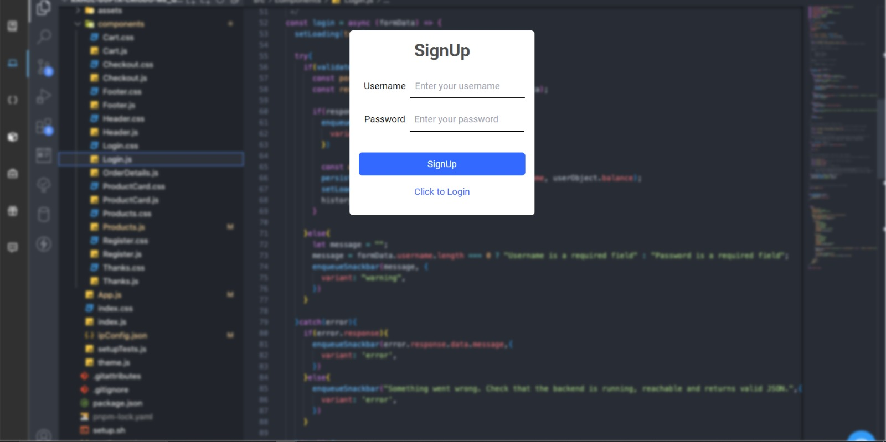
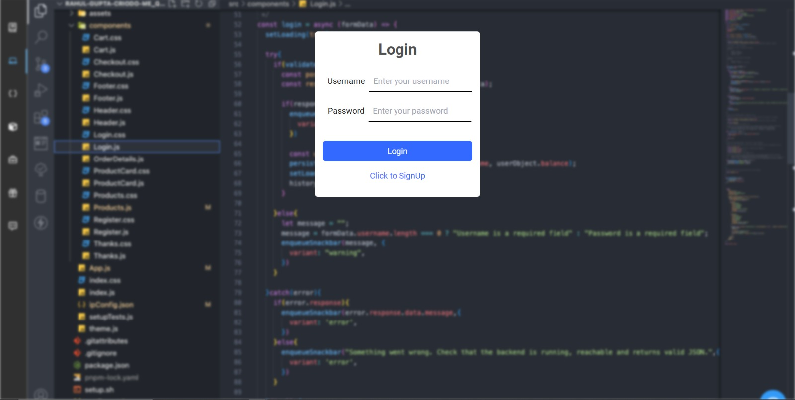
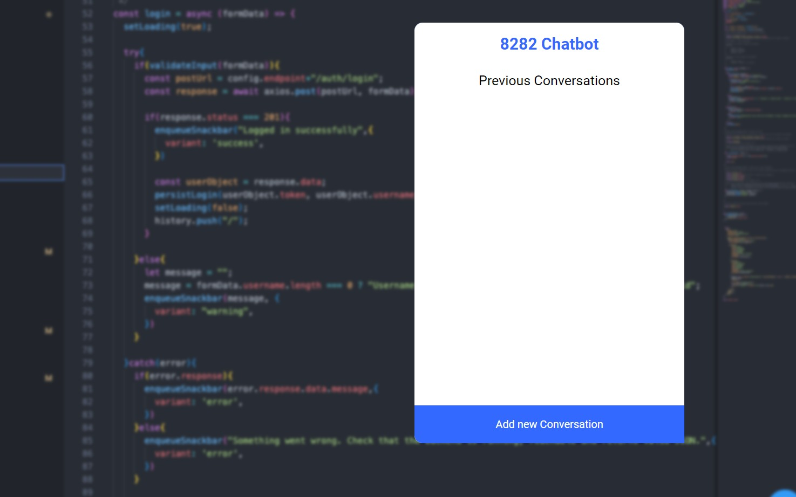
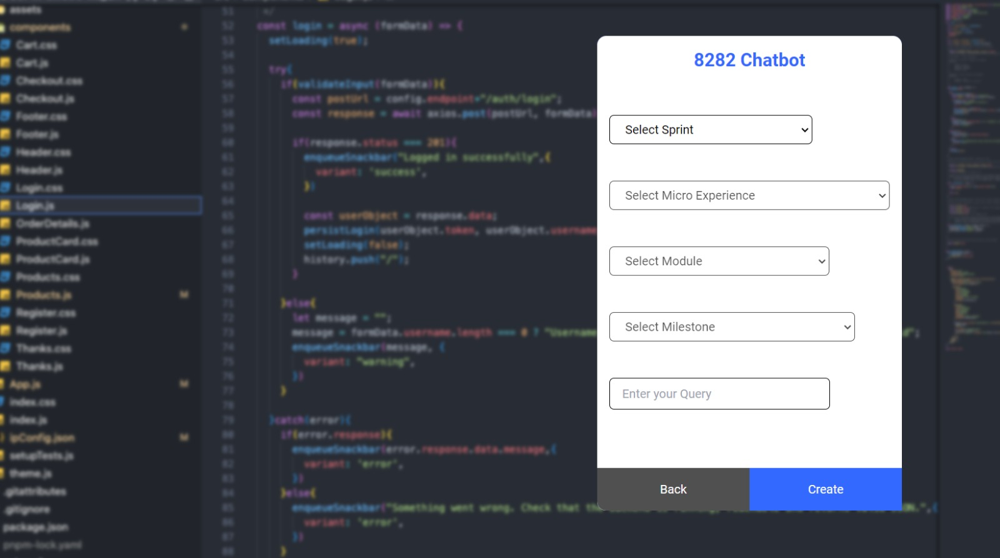
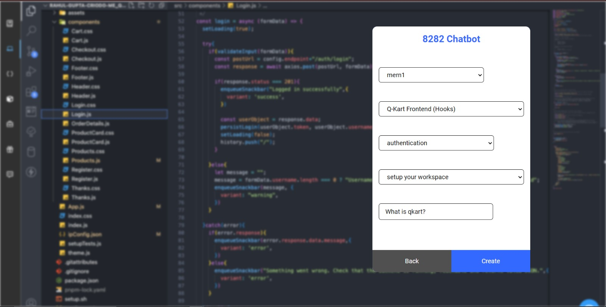
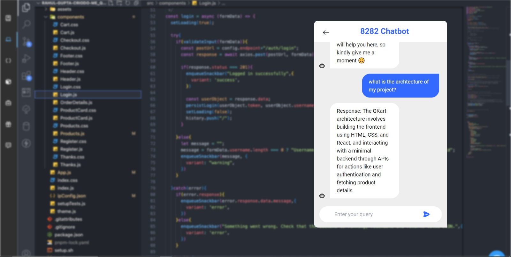

# Virtual Agent for Users to Help Them While Coding

---

## Team Name: 8282 Squad

---

### Team Members:
1. [Omkar Sonawane](https://github.com/Omkarcode11)
2. [Rahul Gupta](https://github.com/RahulGupta77)
3. [Mohammad Alim](https://github.com/alimalim77)
4. [Siddharth Jain](https://github.com/sid123honey)

---

### Project Context:
The objective of this project is to develop a chatbot that enhances the learning experience by:
- Providing answers to frequently asked questions (FAQs) from each module to reduce the ticket count for repetitive doubts.
- Ensuring the chatbot is context-specific within the scope of each sprint.
- Guiding learners with hints rather than providing direct solutions.

### Technologies Used:

| **Category** | **Technologies** |
|--------------|-------------------|
| **Frontend** | TypeScript, React.js, Context API, Axios, Tailwind CSS |
| **Backend**  | Express.js, MongoDB, CORS, Node.js |
| **LLMs and Backend** | Flask, Langchain, Hugging Face Embeddings, FAISS Vector DB, GooglePalm (as LLM) |

### Implementation:
We implemented a Retrieval-Augmented Generation (RAG) based agent to handle FAQs for Qkart and the sales team. The model was deployed locally using Flask. 

### Usage: 
- Access the frontend application via your browser.
- Interact with the chatbot to get FAQs related to Qkart and sales.
- The chatbot will provide hints and guide the learners through their questions without providing direct solutions.

### Acknowledgments:
We thank the Crio.do team for organizing this hackathon and providing us with this learning opportunity.

### Website UI Design 

### 1. Sign up 

### 2. Login

### 3. Chat History

### 4. Select Options

### 5. Milestone Selection

### 6. Conversations 

